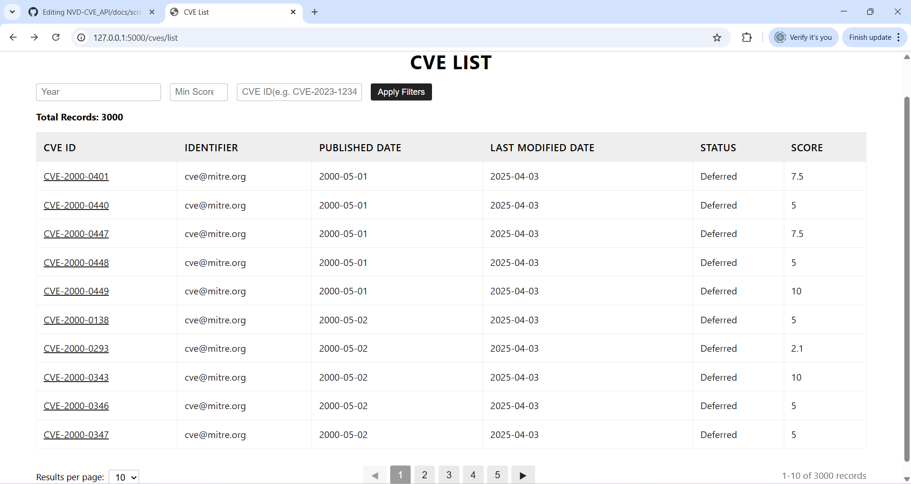
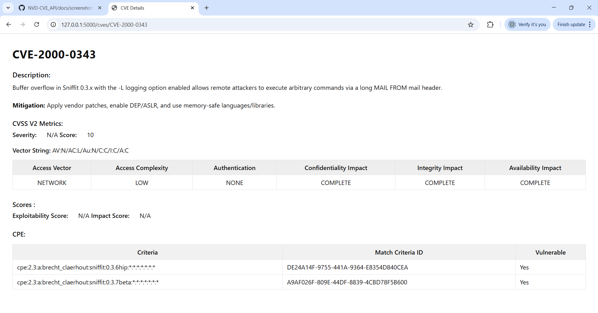

# NVD-CVE_API

This project provides a **Flask-based web application** to fetch, store, and analyze CVE (Common Vulnerabilities and Exposures) data from the [NVD API](https://nvd.nist.gov/developers).  

---

## Features
- Periodic synchronization of CVEs from NVD API (batch mode).
- SQLite3 database with data cleansing & deduplication.
- REST API with filters:
  - By **Year**
  - By **CVE ID**
  - By **CVSS Score**
  - With **server-side sorting** for dates
- Frontend UI:
  - `/cves/list` → CVE list with pagination and sorting
  - `/cves/<id>` → CVE details view
- Unit tests with GitHub Actions integration.

---

## Installation & Setup

### 1. Clone the repository
```bash
git clone https://github.com/GnanambalM/NVD-CVE_API.git
cd NVD-CVE_API
```

### 2. Install dependencies
```bash
pip install -r requirements.txt
```

### 3. Run the application
```bash
python app.py
```
Visit: `http://127.0.0.1:5000`

---

## Project Structure
```
.
├── app.py                  # Main Flask application
├── templates/              # Frontend HTML templates
│   ├── list.html
│   └── details.html
├── static/                 # CSS & JS files
├── tests/                  # Unit tests
│   └── test_api.py
├── requirements.txt        # Dependencies
├── README.md               # Project documentation
└── API_Documentation.md    # API Reference
```

---

## Running Tests
Run all unit tests:
```bash
python -m unittest discover -s tests -p "test_*.py"
```

Tests run automatically in **GitHub Actions CI/CD pipeline**.

---

## Screenshots

### CVE List Page


### CVE Details Page


---

## API Documentation
Detailed API reference can be found here: [API_Documentation.md](API_Documentation.md)

---
